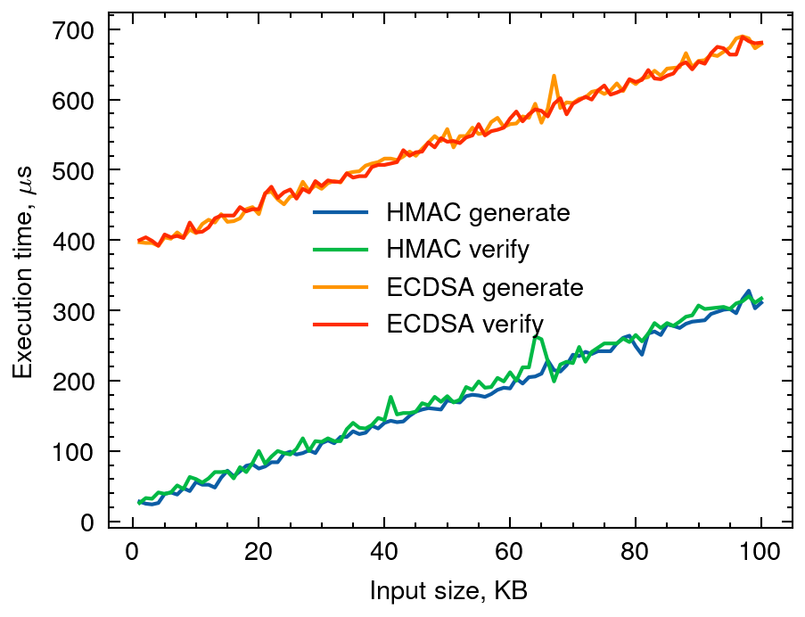

# ECDSA vs HMAC Performance Test

## Disclaimer

This repository contains supporting code for the e-poster titled "Methodology for monitoring the correctness of the transmission of data received from the devices of the CTBTO On-Site Inspectors #764" that is presented on the CTBTO SnT 2025 Conference.

This repository is not in any way affiliated with the CTBTO.

## Table of Contents

<!-- mtoc start -->

- [Benchmark Description](#benchmark-description)
- [Sample Results](#sample-results)
- [Installation](#installation)
    - [Windows](#windows)
    - [Linux/macOS](#linuxmacos)
- [Examples](#examples)
    - [List All Available Options](#list-all-available-options)
    - [Running the Benchmark](#running-the-benchmark)

<!-- mtoc end -->

## Benchmark Description

We consider ECDSA and HMAC both instantiated with the SHA256 hash function.
We use the pycryptodome ECDSA and HMAC implementations.

## Sample Results



The above results were calculated on the computer with the following parameters:

- CPU: AMD Ryzen 5 5600G with Radeon Graphics 3.90 GHz
- RAM: 32 GB
- OS: Windows 10 22H2

## Installation

Ensure you have [Python 3](https://www.python.org/) installed on your system.
To install the Python 3 interpreter, please refer to the official installation instructions for your operating system.

If you use Git, clone this repository using the following command:

```bash
git clone https://github.com/VladlenAfonin/ctbto-snt2025
```

Otherwise download and unarchive this repository using the GitHub UI.
Enter the folder and refer to platform specific instructions below.

### Windows

Execute the following commands using PowerShell.

1. Create virtual environment. In the cloned project directory run:

    ```PowerShell
    python -m venv .venv
    ```

2. Activate virtual environment:

    ```PowerShell
    .\.venv\bin\Activate.ps1
    ```

    The label `(venv)` must now appear to the left of your command prompt.

3. Install the project and its dependencies into the created virtual environment:

    ```PowerShell
    pip3 install -e .
    ```

    You can now test everything worked by running `ctbto-benchmark -h` and see the same output as in the [Examples](#examples) section.

### Linux/macOS

1. Create a virtual environment. In the cloned project directory run

   ```bash
   python3 -m venv .venv
   ```

2. Activate virtual environment:

   ```bash
   source ./.venv/bin/activate
   ```

3. Install dependencies in virtual environment:

   ```bash
   pip3 install -e .
   ```

## Examples

### List All Available Options

```bash
ctbto-benchmark -h
```

```
usage: ctbto-benchmark [-h] [-n NUMBER] [-o FILE] [-s DIR] [-l DIR]

supporting benchmark program for the CTBTO SnT 2025 conference e-poster #764

options:
  -h, --help            show this help message and exit
  -n NUMBER             number of iterations to perform for one measurement. default: 1000
  -o FILE, --output FILE
                        output file name with extension. by default the image isdisplayed after generation in a separate window
  -s DIR, --save DIR    save generated data into a directory
  -l DIR, --load DIR    load generated data from a directory
```

### Running the Benchmark

- run the benchmark with 100 iterations to get each point saving the results in the `./results` folder and storing the resulting image in the `./figure.png` file:

    ```bash
    ctbto-benchmark -n 100 -s "./results" -o "./figure.png"
    ```

- use the saved data from the folder `./results` to build the figure `./figure.png`:

    ```bash
    ctbto-benchmark -l "./results" -o "./figure.png"
    ```

    Please note that the folder must first be created via the `-s` flag.
